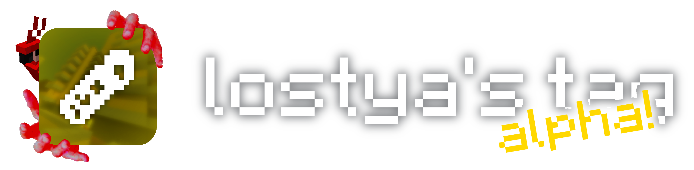

### minecraft: 1.21.3 // core: papermc 1.21.3 #80 // java 21
a minigame about chasing people around. this is an early alpha, most of the stuff requires admin interaction to happen

pls contribute i write code like garbage


# build instructions
after cloning the repo,
1. launch bindownload.py with python3
2. open cmd in the folder that you cloned the repo into
3. `java -Xmx1G -Xms1G -jar server.jar nogui`
4. open the newly created file "eula.txt" and accept minecraft's EULA

now you're good to go. when you run the command from step 3 again, the server will fully launch, ready to be joined.

don't forget to set the port you want to use yourself in `server.properties`. default port is `20189`

join the server yourself from the same machine via `127.0.0.1:20189` or `127.0.0.1:<port>` if you changed it

### recommended to do if you're going to use the server often
**create a script that will run the before mentioned starting command**

example script i use myself:
```
@echo OFF
title lostya's tag
echo Starting...
java -Xmx1G -Xms1G -jar server.jar nogui
```
